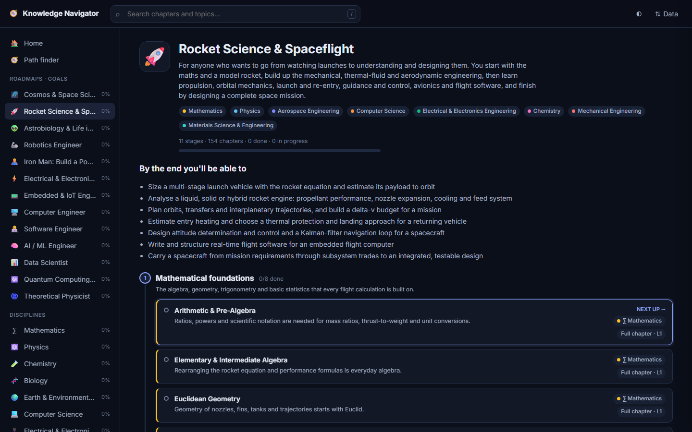
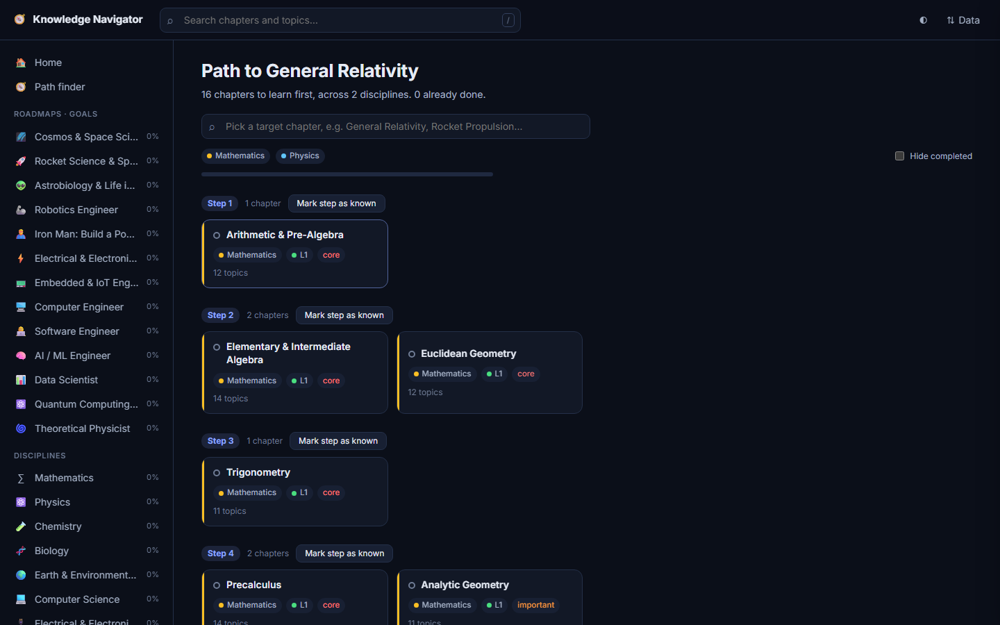

# 🧭 Knowledge Navigator

**An open map of STEM that tells you what to learn, and in what order.**

Pick a goal ("understand the cosmos", "build rockets", "become a robotics engineer") or any
topic, and Knowledge Navigator shows you everything you need to learn first, across maths,
physics, chemistry, biology, computer science and engineering, in an order where every step
builds on the ones before.

**[→ Open the app](https://mohamedmuneerm.github.io/knowledge-navigator/)**. It's free, needs no
sign-up, and your progress stays in your browser.



## What's inside

**11 disciplines · 1,432 chapters · 14,439 topics · 2,430 prerequisite links · 13 roadmaps**

| Disciplines | | |
|---|---|---|
| ∑ Mathematics | ⚛️ Physics | 🧪 Chemistry |
| 🧬 Biology | 🌍 Earth & Environmental Science | 💻 Computer Science |
| 🔌 Electrical & Electronics Engineering | 🤖 AI, Machine Learning & Robotics | ⚙️ Mechanical Engineering |
| 🧱 Materials Science & Engineering | 🚀 Aerospace Engineering | |

**Goal roadmaps:** 🌌 Cosmos & Space Science · 🚀 Rocket Science & Spaceflight · 👽 Astrobiology ·
🦾 Robotics Engineer · 🦸 Iron Man: Build a Powered Exosuit · ⚡ Electrical & Electronics Engineer ·
📟 Embedded & IoT Engineer · 🖥️ Computer Engineer · 👩‍💻 Software Engineer · 🧠 AI / ML Engineer ·
📊 Data Scientist · ⚛️ Quantum Computing · 🌀 Theoretical Physicist

Every chapter has:

- a **level**, from 1 (Foundations: high-school background is enough) to 5 (research frontier);
- its **direct prerequisites**, including ones from other disciplines. Rocket engines need heat
  transfer, which needs thermodynamics, which needs calculus;
- a **topic checklist**, roughly a university course syllabus.

## Features

- **Roadmaps.** A goal as a staged route, with one line on why each chapter matters and a
  *Next up* marker. Every roadmap is checked for completeness: you never meet a chapter before
  its prerequisites.
- **Path finder.** Choose any chapter and get the full ordered list of what to learn before it.
- **Learning order per discipline.** Chapters grouped into stages computed from the prerequisite
  graph, or browsed by category.
- **Progress tracking, notes and links**, saved locally, with JSON export/import for backups.
- **Works offline.** One HTML file plus one data file, with no framework and no server.



## How the content was made, and how much to trust it

The map started as one person's study notes. It was then checked area by area against
authoritative classifications and real curricula: MSC2020 for maths, APS PhySH for physics,
ACM/IEEE CS2023 for CS, the ACS and RSC chemistry guidelines, the ABET and NCEES engineering
specifications, the NASA Technology Taxonomy, and course lists from MIT, Cambridge, Stanford and
others. Gaps were filled from those sources. That curation was done with heavy AI assistance, and
every discipline has an audit report listing its sources and decisions: see
[`docs/AUDIT.md`](docs/AUDIT.md) and [`docs/audit/`](docs/audit/).

It aims to be **curriculum-complete**: everything a strong degree plus graduate coursework covers.
It is not every niche research topic. Levels and prerequisites are judgement calls. **If you know a
field, your review is the most valuable contribution you can make.**

## Contributing

Anyone can help, and you don't need to code:

- In the app, open a chapter and click **⚑ Report a problem** or **✎ Edit on GitHub**.
- [Suggest a chapter or topic](../../issues/new?template=suggest-content.yml), or
  [propose a roadmap](../../issues/new?template=roadmap-idea.yml).
- For bigger changes, see **[CONTRIBUTING.md](CONTRIBUTING.md)**. The data is plain JSON, one
  file per chapter, and the only tool you need is Python.

```bash
git clone https://github.com/MohamedMuneerM/knowledge-navigator.git
cd knowledge-navigator
python scripts/build.py            # validate + generate the app's data file
# then open index.html in a browser

python scripts/path.py ae-liquid-rocket-engines   # print the path to any chapter
```

## Using the data

The whole map is published as JSON at
`https://mohamedmuneerm.github.io/knowledge-navigator/knowledge_base.json`, so you can build your
own tools on it. The source files are in [`data/`](data/), and the format is in
[`data/SCHEMA.md`](data/SCHEMA.md).

## Ideas for what's next

- Free learning resources for every chapter (courses, books, videos): the biggest missing piece
- More disciplines: civil, chemical and biomedical engineering, statistics
- More roadmaps (open an issue with yours)
- An interactive prerequisite-graph view
- Translations

## Licence

- Code (`index.html`, `scripts/`, `.github/`): [MIT](LICENSE)
- Content (`data/`, `docs/`): [CC BY-SA 4.0](LICENSE-DATA.md). Share and adapt it freely with
  credit, and keep derivatives open.
